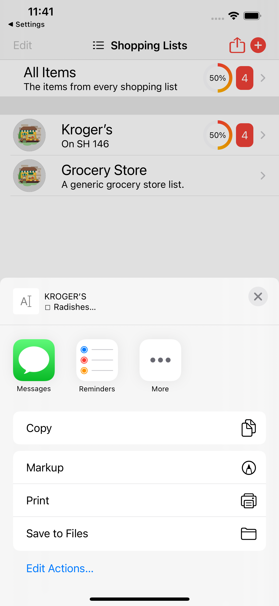
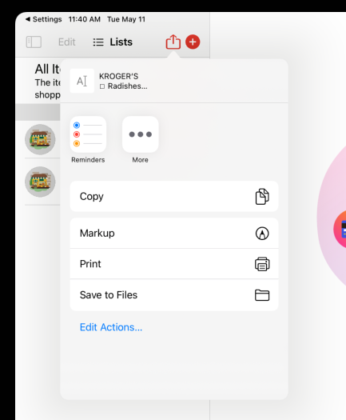
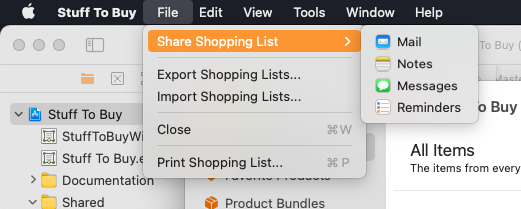

# SwiftUiSharing for Swift and SwiftUI

      

Provides a **Sharing Sheet** on iOS & iPadOS and a **Sharing Menu** on macOS in a SwiftUI fashion that allows the user to share a piece of data using the **Sharing Options** available on the device the app is running on.

<a name="Installation"></a>
## Installation

**Swift Package Manager** (Xcode 11 and above)

1. Select **File** > **Swift Packages** > **Add Package Dependency…** from the **File** menu.
2. Paste `https://github.com/Appracatappra/SwiftUiSharing.git` in the dialog box.
3. Follow the Xcode's instruction to complete the installation.

> Why not CocoaPods, or Carthage, or blank?

Supporting multiple dependency managers makes maintaining a library exponentially more complicated and time consuming.

Since, the **Swift Package Manager** is integrated with Xcode 11 (and greater), it's the easiest choice to support going further.

<a name="iOS-Example"></a>
## iOS Example

Here's an example of using `SwiftUiSharing` on  iOS/iPadOS:

 ```swift
 Button(action: {
     SharingSheet.openMarkdownPrintSheet(markdown: dataStore.allShoppingLists(asMarkdown:true), simpleText: dataStore.allShoppingLists(), fromX: 245.0, fromY: 32.0)
 }) {
     Image(systemName: "square.and.arrow.up")
         .resizable()
         .foregroundColor(Color("AccentColor"))
 }
 .frame(width: 24.0, height: 24.0)
 .help("Share your Shopping Lists")
 ```

Which looks like this on iOS:



Which looks like this on iPadOS:



<a name="macOS-Example"></a>
## macOS Example

Here's an example of using `SwiftUiSharing` on  macOS:

```swift
CommandGroup(replacing: .newItem){
 NSSharingService.sharingMenu(title: "Share Shopping List") {
     return MasterDataStore.SharedDataStore.allShoppingLists()
 }
 
 Divider()
 
 ...
}
```

Which looks like this on macOS:

